# Sơ đồ lớp UML cho E-commerce Service

```mermaid
classDiagram
    %% Entity Classes
    class User {
        -String userId
        -String username
        -String password
        -String name
        -String email
        -String phone
        -Set<Role> roles
        -LocalDateTime createdAt
        +onCreate()
    }

    class Role {
        -String name
        -String description
        -Set<Permission> permissions
    }

    class Permission {
        -String name
        -String description
    }

    class Address {
        -String addressId
        -User user
        -String streetAddress
        -String ward
        -String district
        -String city
    }

    class Order {
        -String orderId
        -User user
        -Address address
        -BigDecimal totalAmount
        -OrderStatus status
        -LocalDateTime createdAt
        +onCreate()
    }

    class InvalidatedToken {
        -String id
        -Date expiration
    }

    %% Controller Classes
    class UserController {
        -UserService userService
        +createUser()
        +getUsers()
        +getUser()
        +getMyInformation()
        +updateUser()
        +deleteUser()
    }

    class AuthenticationController {
        -AuthenticationService authenticationService
        +authenticate()
        +introspect()
        +logout()
    }

    class OrderController {
        -OrderService orderService
        +createOrder()
        +getOrders()
        +getOrderById()
        +getMyOrders()
        +updateOrder()
        +deleteOrder()
        +cancelOrder()
        +approveOrder()
    }

    %% Service Classes
    class UserService {
        -UserRepository userRepository
        -UserMapper userMapper
        -PasswordEncoder passwordEncoder
        -RoleRepository roleRepository
        +createUser()
        +updateUser()
        +userDelete()
        +getUsers()
        +getMyInformation()
        +getUser()
    }

    class AuthenticationService {
        -UserRepository userRepository
        -InvalidatedTokenRepository invalidatedTokenRepository
        -String SIGNING_KEY
        +authenticate()
        +introspect()
        +logout()
        -generateToken()
        -verifyToken()
        -buildScope()
    }

    class OrderService {
        -OrderRepository orderRepository
        -OrderMapper orderMapper
        -UserRepository userRepository
        -AddressRepository addressRepository
        +createOrder()
        +getOrders()
        +getOrderById()
        +updateOrder()
        +deleteOrder()
        +myOrders()
        +cancelOrder()
        +approveOrder()
    }

    %% Repository Interfaces
    class UserRepository {
        <<interface>>
        +existsByUsername()
        +existsByEmail()
        +findByUsername()
        +findByEmail()
    }

    class OrderRepository {
        <<interface>>
        +findByUser_UserId()
    }

    class AddressRepository {
        <<interface>>
        +findByUser_UserId()
    }

    %% Configuration Classes
    class SecurityConfig {
        -CustomJwtDecoder customJwtDecoder
        +filterChain()
        +jwtAuthenticationConverter()
        +passwordEncoder()
    }

    class CustomJwtDecoder {
        -String signerKey
        -AuthenticationService authenticationService
        -NimbusJwtDecoder nimbusJwtDecoder
        +decode()
    }

    %% Relationships
    User "1" -- "*" Address : has
    User "1" -- "*" Order : places
    User "*" -- "*" Role : has
    Role "*" -- "*" Permission : has
    Order "1" -- "1" Address : uses

    UserController --> UserService : uses
    AuthenticationController --> AuthenticationService : uses
    OrderController --> OrderService : uses

    UserService --> UserRepository : uses
    UserService --> UserMapper : uses
    UserService --> RoleRepository : uses
    AuthenticationService --> UserRepository : uses
    AuthenticationService --> InvalidatedTokenRepository : uses
    OrderService --> OrderRepository : uses
    OrderService --> OrderMapper : uses
    OrderService --> UserRepository : uses
    OrderService --> AddressRepository : uses

    SecurityConfig --> CustomJwtDecoder : uses
```

## Giải thích sơ đồ

### 1. Entity Layer

- **User**: Entity chính chứa thông tin người dùng
- **Role**: Định nghĩa các vai trò trong hệ thống
- **Permission**: Định nghĩa các quyền hạn
- **Address**: Thông tin địa chỉ giao hàng
- **Order**: Thông tin đơn hàng
- **InvalidatedToken**: Quản lý token đã hủy

### 2. Controller Layer

- **UserController**: Xử lý các request liên quan đến người dùng
- **AuthenticationController**: Xử lý xác thực và JWT
- **OrderController**: Xử lý các request liên quan đến đơn hàng

### 3. Service Layer

- **UserService**: Logic nghiệp vụ người dùng
- **AuthenticationService**: Logic xác thực và JWT
- **OrderService**: Logic nghiệp vụ đơn hàng

### 4. Repository Layer

- Các interface repository cung cấp các phương thức truy xuất dữ liệu
- Sử dụng Spring Data JPA để tự động implement

### 5. Configuration Layer

- **SecurityConfig**: Cấu hình bảo mật
- **CustomJwtDecoder**: Xử lý JWT token

### 6. Các mối quan hệ

- Dependency injection giữa các layer
- Quan hệ 1-n, n-n giữa các entity
- Luồng dữ liệu từ Controller → Service → Repository
  </rewritten_file>
